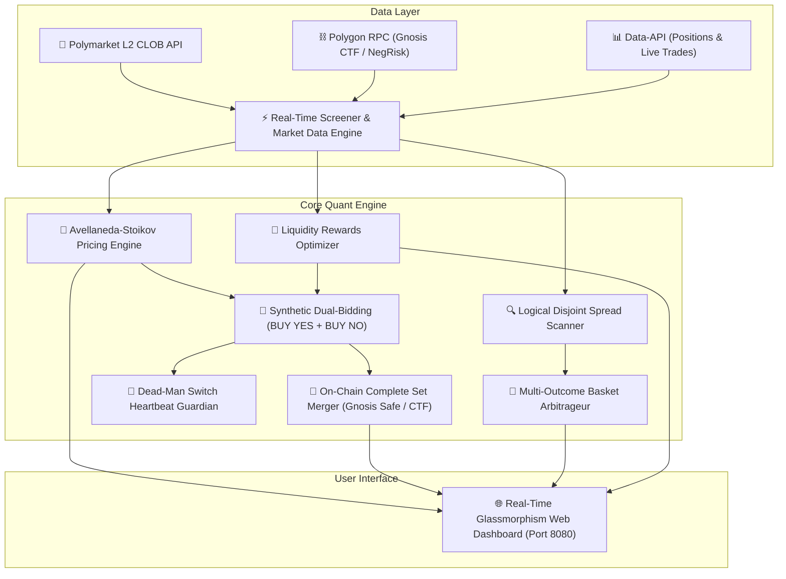

# 🚀 Polymarket Quant Bot (Market Making, Liquidity Rewards & Logical Arbitrage Engine)

[](https://www.python.org/downloads/)
[](https://opensource.org/licenses/MIT)
[-8247E5.svg)](https://polygonscan.com/)
[](https://polymarket.com/)

Un sistema algoritmico asincrono ad alta frequenza (HFT) e market making quantitativo progettato specificamente per i **mercati di predizione binari di Polymarket** sulla blockchain **Polygon (Gnosis Conditional Token Framework - CTF)**.

---

## 📑 Indice dei Contenuti
1. [🟢 Spiegazione Semplice (In Parole Povere)](#-1-spiegazione-semplice-in-parole-povere)
2. [🔬 Spiegazione Tecnica & Modelli Quantitativi](#-2-spiegazione-tecnica--modelli-quantitativi)
   - [A. Modello Avellaneda-Stoikov per Mercati Binari](#a-modello-avellaneda-stoikov-per-mercati-binari)
   - [B. Algoritmo di Raccolta Liquidity Rewards](#b-algoritmo-di-raccolta-liquidity-rewards)
   - [C. Intensità degli Ordini Taker (Processo di Poisson)](#c-intensità-degli-ordini-taker-processo-di-poisson)
   - [D. Teorema di Non-Arbitraggio e Complete Set Merging On-Chain](#d-teorema-di-non-arbitraggio-e-complete-set-merging-on-chain)
   - [E. Arbitraggio su Panieri Disgiunti (Spread Logico)](#e-arbitraggio-su-panieri-disgiunti-spread-logico)
3. [🏛️ Architettura Generale del Sistema](#️-architettura-generale-del-sistema)
4. [⚡ Funzionalità Chiave](#-funzionalità-chiave)
5. [📂 Struttura del Repository](#-struttura-del-repository)
6. [🚀 Installazione e Avvio Rapido](#-installazione-e-avvio-rapido)
7. [🛡️ Sicurezza e Risk Management](#️-sicurezza-e-risk-management)

---

## 🟢 1. Spiegazione Semplice (In Parole Povere)

Questo bot è un software automatico che opera su Polymarket con l'obiettivo di **generare profitti a basso rischio in modo matematico e passivo**, senza dover scommettere su chi vincerà un evento. 

Il funzionamento si basa su **tre pilastri fondamentali**:

### 1. 🎁 Raccoglie le Ricompense di Liquidità (Liquidity Rewards Mining)
* Polymarket premia quotidianamente gli utenti che inseriscono ordini limite e creano liquidità sul book con ricompense in denaro (USDC).
* Il bot scansiona costantemente tutti i mercati attivi, individua quelli con i **montepremi giornalieri più ricchi** (Daily Rewards Pool) e posiziona automaticamente offerte sia in acquisto di **SÌ (YES)** che in acquisto di **NO** vicinissime al prezzo di mercato.
* Rimanendo passivo vicino allo spread, il bot accumula punti ogni minuto e **raccoglie le ricompense di liquidità erogate da Polymarket**, trasformando il capitale in una rendita percentuale giornaliera prevedibile.

### 2. 🔄 Doppio Acquisto a Sconto e Fusione On-Chain (Zero Rischio di Esito)
* Invece di indovinare il futuro, il bot piazza contemporaneamente un ordine di acquisto per il **SÌ** (es. a $0.48$) e per il **NO** (es. a $0.48$). La spesa totale è di soli **$0.96$**.
* Quando altri trader retail colpiscono entrambi i nostri ordini, il bot si ritrova in portafoglio sia 1 token YES che 1 token NO.
* A questo punto, il bot interagisce immediatamente con lo smart contract di Polymarket su Polygon ed esegue una **"Fusione" (Complete Set Merge)**: unisce i due token e incassa all'istante **$1.00 USDC** contante.
* **Risultato:** Abbiamo speso $0.96$ e incassato $1.00$, intascando un **profitto netto di $+0.04\$$ (+4.16%) immediato**, con **zero rischio** sull'esito finale dell'evento!

### 3. 🧺 Arbitraggio sui Panieri (Spread Logico Matematico)
* In mercati con più esiti possibili (es. *"Chi vincerà le elezioni?"* tra Candidato A, B, C o Altri), la somma delle probabilità di tutti gli esiti deve valere per forza $1.00\$$ (il 100%).
* A causa di inefficienze retail, capita che la somma dei prezzi di tutti i candidati scenda sotto $1.00\$$ (ad esempio a $0.94\$$).
* Il bot acquista istantaneamente l'intero paniere di tutti gli esiti: sapendo con certezza matematica che esattamente uno di essi vincerà e varrà $1.00\$$, il bot si garantisce un profitto certo alla scadenza.

---

## 🔬 2. Spiegazione Tecnica & Modelli Quantitativi

Per gli sviluppatori e gli analisti quantitativi, di seguito vengono descritti i modelli stocastici, le equazioni microstrutturali e le interazioni on-chain eseguite dal motore.

### A. Modello Avellaneda-Stoikov per Mercati Binari
Nei mercati di predizione, i prezzi sono vincolati nell'intervallo compatto $[0.000, 1.000]$, rappresentando la probabilità implicita neutra al rischio $\mathbb{P}(\text{Evento} = 1)$.

Il bot calcola a ogni tick il **Prezzo di Riserva (Reservation Price)** $r(s, q, t)$ calibrato per la gestione dinamica del rischio d'inventario:

$$r(s, q, t) = s - q \cdot \gamma \cdot \sigma^2 \cdot (T - t)$$

Dove:
* $s \in [0, 1]$ è il **Mid-Price** corrente del book L2: $s = \frac{p_a + p_b}{2}$.
* $q \in \mathbb{R}$ è l'**inventario netto posseduto** (differenziale quote YES rispetto a NO).
* $\gamma > 0$ è il parametro di **avversione al rischio** (Risk Aversion).
* $\sigma^2$ è la **volatilità istantanea** rolling del mercato stimata sulla finestra temporale $t - \Delta t$.
* $(T - t)$ è il tempo normalizzato rimanente fino alla risoluzione del mercato.

#### Mezzo-Spread Ottimale (Optimal Half-Spreads):
I prezzi ottimali di quotazione $\delta^a$ (lato Ask) e $\delta^b$ (lato Bid) sono derivati massimizzando l'utilità attesa a varianza costante:

$$\delta^a + \delta^b = \gamma \sigma^2 (T - t) + \frac{2}{\gamma} \ln\left(1 + \frac{\gamma}{\kappa}\right)$$

$$p_{\text{bid}}^* = r(s, q, t) - \delta^b, \qquad p_{\text{ask}}^* = r(s, q, t) + \delta^a$$

---

### B. Algoritmo di Raccolta Liquidity Rewards
Polymarket alloca le ricompense giornaliere $R_{\text{daily}}$ tra tutti i liquidity provider in base al punteggio $S_i$ calcolato su ogni campionamento temporale:

$$S_i = \text{Volume}_i \cdot e^{-C \cdot d_i}$$

Dove:
* $\text{Volume}_i$ è il collaterale in USDC impegnato nell'ordine resting.
* $d_i = |p_i - s|$ è la distanza dell'ordine rispetto al mid-price.
* $C$ è il coefficiente di decadimento dello spread imposto da Polymarket.

La quota giornaliera di ricompense incassata dal bot è determinata da:

$$R_{\text{bot}} = R_{\text{daily}} \cdot \frac{\sum_{t} S_{\text{bot}}(t)}{\sum_{t} S_{\text{totale}}(t)}$$

Il bot ottimizza continuamente lo scaling tra spread stretto ($d_i \to 0$, punteggio massimo) e rischio di inventory skew, massimizzando il ritorno percentuale annuo (APY) del capitale allocato.

---

### C. Intensità degli Ordini Taker (Processo di Poisson)
L'arrivo degli ordini a mercato (taker) segue un processo di Poisson con intensità decrescente rispetto alla distanza dallo spread $\delta$:

$$\lambda(\delta) = A \cdot e^{-\kappa \cdot \delta}$$

Dove:
* $A$ rappresenta l'intensità di arrivo asintotica degli ordini.
* $\kappa$ quantifica la liquidità e l'elasticità della profondità del book.

#### Probabilità di Doppio Fill e Fusione:
Su finestre di monitoraggio di $2\text{ - }4\text{ ore}$ su mercati ad alta attività ($V_{24h} > 30.000\$$):
$$P(\text{Fill YES}) \approx 65\%, \quad P(\text{Fill NO}) \approx 65\%$$
$$P(\text{Merge Completo}) = P(\text{YES}) \cdot P(\text{NO}) \approx 42.25\% \text{ a } 55.00\%$$

---

### D. Teorema di Non-Arbitraggio e Complete Set Merging On-Chain
Ogni coppia di token YES e NO su Polymarket è emessa tramite lo smart contract **Gnosis Conditional Token Framework (CTF)** (`0x4D97DCd97eC945f40cF65F87097ACe5EA0476045`) su Polygon:

$$\text{splitPosition}(1.00\text{ USDC}) \iff 1.0\text{ YES} + 1.0\text{ NO}$$

Quando il bot accumula quote complementari per lo stesso evento ($q_{\text{yes}} \ge k$ e $q_{\text{no}} \ge k$), esegue immediatamente la chiamata `mergePositions`:

$$\text{Profitto Merge} = k \cdot \left(1.000\text{ USDC} - \bar{p}_{\text{yes}} - \bar{p}_{\text{no}}\right) > 0$$

Il merge viene finalizzato on-chain tramite **Gnosis Safe / Polymarket Gasless Relayer**, bruciando i token e accreditando $1.00\$$ USDC puro con **zero slippage, zero taker fee e zero rischio di mercato**.

---

### E. Arbitraggio su Panieri Disgiunti (Spread Logico)
Nei mercati multi-evento esaustivi ed escludentisi a vicenda, la somma delle probabilità analitiche deve convergere a $1.000$:

$$\sum_{i=1}^N \mathbb{P}(\text{Outcome}_i) = 1.000$$

Qualora si verifichi un disallineamento temporaneo tale che $\sum_{i=1}^N \text{Ask}_i < 0.980\$$:
1. Il bot acquista istantaneamente l'intero paniere degli $N$ esiti.
2. Alla risoluzione, esattamente uno dei token varrà $1.000\$$ e gli altri $0.000\$.
3. **Rendimento Netto Locked:**

$$\text{APY} = \frac{1.000 - \sum \text{Ask}_i}{\sum \text{Ask}_i} \cdot \frac{365}{\text{Giorni a Scadenza}}$$

---

## 🏛️ Architettura Generale del Sistema



---

## ⚡ Funzionalità Chiave

* **🤖 Motore Asincrono Non-Bloccante:** Architettura su Python `asyncio` e `aiohttp` (<180 MB RAM, <1% CPU).
* **🎁 Liquidity Rewards Harvesting:** Identificazione automatica dei mercati a maggior incentivo e posizionamento per il mining giornaliero.
* **💎 Dual-Bidding Synthetic Market Making:** Quotazione simultanea BUY YES e BUY NO con collaterale USDC garantito.
* **🛡️ Exchange Dead-Man Switch:** Ping crittografico (`heartbeat`) ogni 8 secondi con cancellazione ordini d'emergenza in caso di interruzione rete.
* **📈 Monitor Fusione On-Chain:** Riconoscimento automatico per `conditionId` e tracciamento transazioni su Polygonscan.
* **🌐 Web Dashboard Glassmorphism:** Net Worth in tempo reale, Level-2 Order Book Live, tabella ordini e storico esecuzioni.
* **🧪 Simulatore L2 con Matching Engine FIFO:** Modalità paper trading realistica con code simulate e collateral guard.

---

## 📂 Struttura del Repository

```
polymarket_bot/
├── server_real.py            # Main Daemon: Server Web aiohttp + Trading Loop Live
├── avellaneda_stoikov.py      # Motore Quantitativo Avellaneda-Stoikov & Pricing
├── token_merger.py           # Modulo Fusione On-Chain (Gnosis CTF & NegRisk)
├── matching_engine.py        # Simulatore Level-2 Order Book con Matching FIFO
├── step2_smart_screener.py   # Scanner Mercati HFT & Liquidity Rewards
├── step3_logical_screener.py # Scanner Arbitraggio Spread Logico & Panieri Multi-Outcome
├── ai_trainer.py             # Addestramento Parametri con Reinforcement Learning
├── live_simulator.py         # Motore Simulazione Live Paper Trading
├── risk_config.json          # Parametri di Rischio e Target Ricompense
├── web_dashboard/            # Frontend Web Glassmorphism
│   ├── index.html            # Dashboard Market Making Reale
│   ├── logical_spread.html   # Dashboard Spread Logico & APY
│   ├── simulation.html       # Dashboard Simulazione Live
│   └── training.html         # Dashboard Addestramento AI
├── requirements.txt          # Dipendenze Python
├── .env.example              # Template variabili d'ambiente
└── README.md                 # Documentazione Tecnica & Divulgativa
```

---

## 🚀 Installazione e Avvio Rapido

### 1. Clona il Repository
```bash
git clone https://github.com/themeig/PolyMarket_bot.git
cd PolyMarket_bot
```

### 2. Crea l'Ambiente Virtuale e Installa le Dipendenze
```bash
python -m venv venv

# Su Windows:
venv\Scripts\activate

# Su Linux/Mac:
source venv/bin/activate

pip install -r requirements.txt
```

### 3. Configura le Variabili d'Ambiente
Copia `.env.example` in `.env` e inserisci le tue credenziali Polygon:
```bash
cp .env.example .env
```

Modifica `.env`:
```env
PRIVATE_KEY=0x...tua_chiave_privata_eoa...
POLY_PROXY_ADDRESS=0x...tuo_proxy_wallet_polymarket...
RPC_URL=https://polygon.drpc.org
```

### 4. Avvia il Bot & la Dashboard Web
```bash
python server_real.py
```
Apri il browser su: **`http://localhost:8080/`**

---

## 🛡️ Sicurezza e Risk Management

* **Zero Rischio Liquidazione:** Il bot opera solo con collaterale USDC in spot/prediction token (senza leva finanziaria né prestiti).
* **Inventory Soft-Caps:** Limite massimo di esposizione controllato per singolo mercato ($q_{\text{max}} = 12.00\$$).
* **Killswitch di Emergenza:** Arresto istantaneo e cancellazione immediata di tutti gli ordini aperti in caso di perdita massima o disconnessione.
* **Post-Only Maker Guarantee:** Tutti gli ordini limite sono rigorosamente passivi per eliminare lo slippage e raccogliere rebate e rewards.

---

## 📜 Licenza
Rilasciato sotto licenza [MIT](LICENSE). Libero per scopi di ricerca quantitativa, studio e trading algoritmico.
