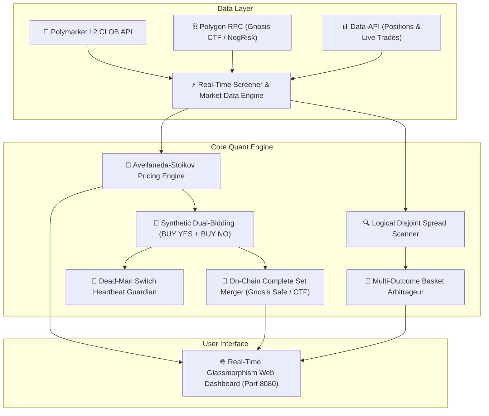

# 🚀 Polymarket Quant Bot (Institutional Market Making & Logical Arbitrage Engine)

[](https://www.python.org/downloads/)
[](https://opensource.org/licenses/MIT)
[-8247E5.svg)](https://polygonscan.com/)
[](https://polymarket.com/)

An institutional-grade, asynchronous High-Frequency Trading (HFT) and Market Making platform engineered specifically for **Polymarket binary prediction markets** running on **Polygon (Gnosis Conditional Token Framework - CTF)**.

The bot combines **Stochastic Optimal Control (Avellaneda-Stoikov model)**, **Synthetic Dual-Bidding**, **On-Chain Complete Set Merging**, and **Disjoint Event Multi-Outcome Basket Arbitrage**, wrapped inside a real-time glassmorphism web dashboard.

---

## 📑 Indice dei Contenuti
1. [Architettura Generale del Sistema](#-architettura-generale-del-sistema)
2. [Modelli Matematici & Microstruttura dei Mercati](#-modelli-matematici--microstruttura-dei-mercati)
   - [1. Modello Avellaneda-Stoikov per Mercati Binari](#1-modello-avellaneda-stoikov-per-mercati-binari)
   - [2. Intensità degli Ordini Taker (Processo di Poisson / Hawkes)](#2-intensità-degli-ordini-taker-processo-di-poisson--hawkes)
   - [3. Teorema di Non-Arbitraggio e Complete Set Merging](#3-teorema-di-non-arbitraggio-e-complete-set-merging)
   - [4. Arbitraggio su Panieri Disgiunti (Spread Logico)](#4-arbitraggio-su-panieri-disgiunti-spread-logico)
3. [Funzionalità Chiave](#-funzionalità-chiave)
4. [Struttura del Repository](#-struttura-del-repository)
5. [Installazione e Avvio Rapido](#-installazione-e-avvio-rapido)
6. [Sicurezza e Risk Management](#-sicurezza-e-risk-management)

---

## 🏛️ Architettura Generale del Sistema



---

## 🧮 Modelli Matematici & Microstruttura dei Mercati

### 1. Modello Avellaneda-Stoikov per Mercati Binari
Nei mercati di predizione tradizionali, i prezzi sono vincolati nell'intervallo compatto $[0.000\$, 1.000\$]$, rappresentando la probabilità implicita $\mathbb{P}(	ext{Evento} = 1)$.

Il bot calcola il **Prezzo di Riserva (Reservation Price)** $r(s, q, t)$ calibrato per la gestione dinamica del rischio d'inventario:

$$r(s, q, t) = s - q \cdot \gamma \cdot \sigma^2 \cdot (T - t)$$

Dove:
* $s \in [0, 1]$ è il **Mid-Price** corrente del book L2: $s = rac{p_a + p_b}{2}$.
* $q \in \mathbb{R}$ è l'**inventario netto posseduto** (es. quantità di quote YES rispetto a NO).
* $\gamma > 0$ è il parametro di **avversione al rischio** (Risk Aversion).
* $\sigma^2$ è la **volatilità istantanea** del mercato stimata sulla finestra rolling $t - \Delta t$.
* $(T - t)$ è il tempo normalizzato rimanente fino alla risoluzione del mercato.

#### Mezzo-Spread Ottimale (Optimal Half-Spreads):
I prezzi ottimali di quotazione $\delta^a$ (lato Ask) e $\delta^b$ (lato Bid) sono derivati massimizzando la funzione di utilità attesa a varianza costante:

$$\delta^a + \delta^b = \gamma \sigma^2 (T - t) + rac{2}{\gamma} \ln\left(1 + rac{\gamma}{\kappa}
ight)$$

$$p_{	ext{bid}}^* = r(s, q, t) - \delta^b, \qquad p_{	ext{ask}}^* = r(s, q, t) + \delta^a$$

---

### 2. Intensità degli Ordini Taker (Processo di Poisson / Hawkes)
La probabilità istantanea che un ordine limite resting sul book venga colpito da un trader retail segue un processo di Poisson stocastico dipendente dalla profondità $\delta$:

$$\lambda(\delta) = A \cdot e^{-\kappa \cdot \delta}$$

Dove:
* $A$ è il volume di arrivo ordini asintotico a mercato.
* $\kappa$ è la sensibilità della liquidità rispetto alla distanza dallo spread.

#### Probabilità di Doppio Fill e Fusione:
Su un orizzonte rolling di $2	ext{ - }4	ext{ ore}$ su mercati ad alta liquidità ($V_{24h} > 30.000\$$):
$$P(	ext{Fill YES}) pprox 65\%, \quad P(	ext{Fill NO}) pprox 65\%$$
$$P(	ext{Merge Completo}) = P(	ext{YES}) 	imes P(	ext{NO}) pprox \mathbf{42.25\% 	ext{ a } 55.00\%}$$

---

### 3. Teorema di Non-Arbitraggio e Complete Set Merging
Ogni token YES e NO su Polymarket è emesso attraverso lo smart contract **Gnosis Conditional Token Framework (CTF)** (`0x4D97DCd97eC945f40cF65F87097ACe5EA0476045`) su Polygon:

$$	ext{splitPosition}(1.00\$	ext{ USDC}) \iff 1.0	ext{ YES} + 1.0	ext{ NO}$$

Quando il bot accumula quote complementari dello stesso evento ($q_{	ext{yes}} \ge k$ e $q_{	ext{no}} \ge k$):

$$	ext{Profitto Merge} = k \cdot \left(1.000\$ - ar{p}_{	ext{yes}} - ar{p}_{	ext{no}}
ight) > 0$$

Il merge viene eseguito on-chain via **Gnosis Safe / Polymarket Gasless Relayer**, bruciando i token e accreditando $1.00\$$ USDC puro con **zero slippage, zero taker fee e zero rischio di mercato**.

---

### 4. Arbitraggio su Panieri Disgiunti (Spread Logico)
In mercati multi-evento mutuamente esclusivi ed esaustivi (es. elezioni politiche, vincitore torneo), la somma delle probabilità deve convergere matematicamente a $1.000\$:

$$\sum_{i=1}^N \mathbb{P}(	ext{Outcome}_i) = 1.000\$$$

Se a causa di inefficienze retail $\sum_{i=1}^N 	ext{Ask}_i < 0.980\$$:
1. Il bot acquista istantaneamente l'intero paniere di $N$ esiti.
2. Alla risoluzione dell'evento, esattamente uno degli $N$ esiti varrà $1.000\$$ mentre gli altri varranno $0.000\$.
3. **Rendimento Netto Locked:** $	ext{APY} = rac{1.000 - \sum 	ext{Ask}_i}{\sum 	ext{Ask}_i} 	imes rac{365}{	ext{Giorni a Scadenza}}$.

---

## ⚡ Funzionalità Chiave

* **🤖 Motore Asincrono Non-Bloccante:** Costruito su Python `asyncio` e `aiohttp` (<180 MB RAM, <1% CPU).
* **💎 Dual-Bidding Synthetic Market Making:** Quota contemporaneamente BUY YES e BUY NO con collaterale USDC garantito.
* **🛡️ Exchange Dead-Man Switch:** Ping crittografico (`heartbeat`) inviato ogni 8 secondi per cancellare ordini se il server cade.
* **📈 Monitor Fusione On-Chain:** Riconoscimento automatico per `conditionId` e tracciamento transazioni Polygon.
* **🌐 Web Dashboard Glassmorphism:** Grafico Net Worth in tempo reale, Level-2 Order Book Live, tabella ordini e storico trades.
* **🧪 Simulatore L2 con Matching Engine FIFO:** Modalità paper trading con simulazione di code, spread reali e collateral guard.

---

## 📂 Struttura del Repository

```
polymarket_bot/
├── server_real.py            # Main Daemon: Server Web aiohttp + Trading Loop Live
├── avellaneda_stoikov.py      # Motore Quantitativo Avellaneda-Stoikov & Pricing
├── token_merger.py           # Modulo Fusione On-Chain (Gnosis CTF & NegRisk)
├── matching_engine.py        # Simulatore Level-2 Order Book con Matching FIFO
├── step2_smart_screener.py   # Scanner Mercati HFT (Tight Spread) & Wide Spread
├── step3_logical_screener.py # Scanner Arbitraggio Spread Logico & Panieri Multi-Outcome
├── ai_trainer.py             # Addestramento Parametri con Reinforcement Learning
├── live_simulator.py         # Motore Simulazione Live Paper Trading
├── web_dashboard/            # Frontend Web Glassmorphism
│   ├── index.html            # Dashboard Market Making Reale
│   ├── logical_spread.html   # Dashboard Spread Logico & APY
│   ├── simulation.html       # Dashboard Simulazione Live
│   └── training.html         # Dashboard Addestramento AI
├── requirements.txt          # Dipendenze Python
├── .env.example              # Template variabili d'ambiente
└── README.md                 # Documentazione Tecnica Istituzionale
```

---

## 🚀 Installazione e Avvio Rapido

### 1. Clona il Repository
```bash
git clone https://github.com/themeig/PolyMarket_bot.git
cd PolyMarket_bot
```

### 2. Crea l'Ambiente Virtuale e Installa le Dipendenze
```bash
python -m venv venv
# Su Windows:
venv\Scriptsctivate
# Su Linux/Mac:
source venv/bin/activate

pip install -r requirements.txt
```

### 3. Configura le Variabili d'Ambiente
Copia `.env.example` in `.env` e inserisci le tue credenziali Polygon:
```bash
cp .env.example .env
```

Modifica `.env`:
```env
PRIVATE_KEY=0x...tua_chiave_privata_eoa...
POLY_PROXY_ADDRESS=0x...tuo_proxy_wallet_polymarket...
RPC_URL=https://polygon.drpc.org
```

### 4. Avvia il Bot & la Dashboard Web
```bash
python server_real.py
```
Apri il browser su: **`http://localhost:8080/`**

---

## 🛡️ Sicurezza e Risk Management

* **Zero Rischio Liquidazione:** Il bot opera solo con collaterale USDC in spot/prediction token (senza leva finanziaria).
* **Inventory Soft-Caps:** Limite massimo di esposizione per singolo mercato ($q_{	ext{max}} = 12.00\$$).
* **Killswitch di Emergenza:** Arresto istantaneo e cancellazione immediata di tutti gli ordini aperti al raggiungimento della soglia di perdita massima ($-	ext{SL Limit}$).
* **Post-Only Maker Guarantee:** Tutti gli ordini limite sono passivi per eliminare lo slippage e massimizzare i rebate.

---

## 📜 Licenza
Rilasciato sotto licenza [MIT](LICENSE). Libero per scopi di ricerca quantitativa, studio e trading algoritmico.
