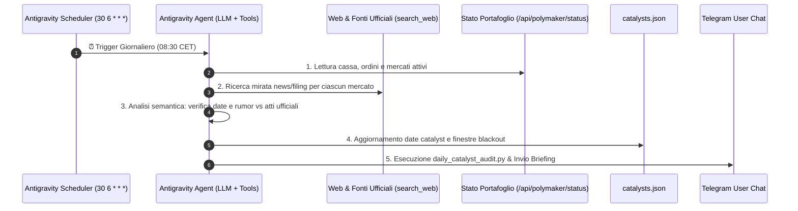

# 🤖 Antigravity Autonomous Cronjob & Catalyst Risk Engine

Questo documento spiega nel dettaglio l'architettura, la configurazione e l'implementazione del **Cronjob Autonomo di Antigravity** integrato nel bot di Polymarket per l'audit giornaliero del portafoglio e il de-risking pre-evento sui mercati di predizione.

---

## 📑 Indice
1. [Perché un Cronjob con Agente AI?](#1-perché-un-cronjob-con-agente-ai)
2. [Sintassi e Frequenza del Cron (30 6 * * *)](#2-sintassi-e-frequenza-del-cron-30-6---)
3. [Flusso Operativo e Architettura](#3-flusso-operativo-e-architettura)
4. [Separazione dei Ruoli: AI vs Script Deterministico](#4-separazione-dei-ruoli-ai-vs-script-deterministico)
5. [Integrazione con il Catalyst Calendar (catalysts.json)](#5-integrazione-con-il-catalyst-calendar-catalystsjson)
6. [Applicabilità Multi-Mercato (Generalizzazione)](#6-applicabilità-multi-mercato-generalizzazione)
7. [Come Modificare Frequenza o Orario](#7-come-modificare-frequenza-o-orario)

---

## 1. Perché un Cronjob con Agente AI?

In un sistema di market making tradizionale, gli script schedulati eseguono compiti rigidi e deterministici. Tuttavia, nei mercati di predizione (es. *"Anthropic IPO by October 15, 2026?"* o *"Fed rate decision"*), il rischio principale non è solo matematico ma **informativo**:
* Notizie inaspettate, anticipazioni sui media o depositi di documenti regolatori (Form S-1, verbali FOMC) possono provocare salti violenti di prezzo (*Jump Ticks*).
* Un semplice script Python di keyword matching sui feed RSS non è in grado di comprendere se una notizia sia una speculazione infondata su un blog o un atto formale della SEC.

**La Soluzione di Antigravity:**  
Separare il bot in due livelli:
1. **Motore di Esecuzione a Bassa Latenza (`poly-maker`)**: Lavora 24/7 sui millisecondi del book Polymarket;
2. **Agente AI come Risk Officer (Antigravity)**: Si sveglia a orari programmati tramite un cron daemon permanente, effettua ricerche online mirate sui canali ufficiali con gli strumenti di ricerca semantica, analizza il contesto e aggiorna le regole di protezione del market maker.

---

## 2. Sintassi e Frequenza del Cron (`30 6 * * *`)

Il cronjob è registrato nel motore interno di Antigravity tramite la chiamata:
```python
schedule(
    CronExpression="30 6 * * *",
    IsDaemon=True,
    Prompt="..."
)
```

### Decodifica dei 5 Campi Standard:
```text
 ┌───────────── Minuto (0 - 59)          --> 30
 │ ┌─────────── Ora (0 - 23, in UTC)     --> 6 (06:00 UTC)
 │ │ ┌───────── Giorno del mese (1 - 31) --> * (ogni giorno)
 │ │ │ ┌─────── Mese (1 - 12)            --> * (ogni mese)
 │ │ │ │ ┌───── Giorno della settimana   --> * (tutti i giorni, Lun-Dom)
 │ │ │ │ │
 30 6 * * *
```

* **Frequenza:** Eseguito **una volta al giorno**, tutti i giorni.
* **Orario:** Alle **06:30 UTC**, corrispondenti alle **`08:30` del mattino in Italia (CET/CEST)**.
* **Motivazione dell'orario:**
  * **Rewards Polymarket già accreditati:** Polymarket calcola e distribuisce le ricompense di liquidità alle 00:00 UTC (02:00 italiane). Alle 08:30 il portafoglio riflette già l'accredito esatto.
  * **Apertura Borse Europee e Pre-Market USA:** Permette di intercettare comunicati stampa mattutini prima delle forti oscillazioni di Wall Street.

---

## 3. Flusso Operativo e Architettura



---

## 4. Separazione dei Ruoli: AI vs Script Deterministico

Per massimizzare affidabilità e sicurezza, il sistema è diviso in due componenti complementari:

| Compito | Componente Responsabile | Come Funziona |
| :--- | :--- | :--- |
| **Ricerca & Comprensione Qualitativa** | **Antigravity AI Agent** | Usa `search_web` e `read_url_content`. Comprende filing SEC, distingue voci di corridoio da contratti reali e sintetizza le note in `ai_briefing_notes.txt`. |
| **Matematica & Contabilità Deterministica** | **[`daily_catalyst_audit.py`](file:///c:/Users/HP/Desktop/polymarket_bot/daily_catalyst_audit.py)** | Script Python puro. Nessuno scraping fragile: calcola Net Worth, Cassa Libera, Margine negli Ordini, PnL storico e invia il messaggio formattato HTML su Telegram. |

---

## 5. Integrazione con il Catalyst Calendar (`catalysts.json`)

Se l'Agente AI individua un annuncio confermato o una data di risoluzione imminente, aggiorna [`catalysts.json`](file:///c:/Users/HP/Desktop/polymarket_bot/catalysts.json):

```json
[
  {
    "id": "anthropic-s1-prospectus",
    "market_slug": "will-anthropic-ipo-by-october-15-2026-949",
    "title": "Anthropic Public S-1 Prospectus Release Window",
    "event_date_utc": "2026-09-28T16:00:00Z",
    "reduce_only_hours": 72.0,
    "halt_before_minutes": 30.0,
    "cooloff_post_minutes": 60.0,
    "source": "SEC EDGAR / Official Company Reports",
    "status": "ACTIVE"
  }
]
```

### Le 4 Fasi di Protezione del Market Maker:
1. **`NORMAL`:** Distante dall'evento. Il bot quota bidirezionalmente (BUY + SELL) e raccoglie liquidity rewards;
2. **`REDUCE_ONLY` (T - 72h):** Nessun nuovo acquisto BUY. Vengono quotati solo ordini passivi di vendita ASK (*Urgency Walk-down*) per smaltire le quote residue a prezzo pieno;
3. **`BLACKOUT` (T - 30m):** Cancellazione istantanea del 100% degli ordini sul book. Nessun trader HFT o cecchino può colpire offerte a prezzi superati durante l'annuncio;
4. **`COOLOFF` (T + 60m):** Attesa della stabilizzazione del book post-evento, ricalcolo del Fair Value e ripresa ordinata del quoting.

---

## 6. Applicabilità Multi-Mercato (Generalizzazione)

Il sistema **non è limitato ad Anthropic**:
* All'avvio dell'audit, l'Agente interroga la lista completa di tutti i mercati in portafoglio:
  ```python
  active_markets = [p['title'] for p in status['positions']] + [status['active_market']['title']]
  ```
* Se il portafoglio detiene mercati su **Elezioni Politiche**, **Tassi Fed (FOMC)**, **OpenAI** o **Crypto ETF**, l'Agente lancia ricerche specializzate per ogni singolo mercato e gestisce scadenze indipendenti.

---

## 7. Come Modificare Frequenza o Orario

Il cronjob permanente può essere riconfigurato o rischedulato in qualsiasi momento con il comando `schedule` di Antigravity:

* **Due volte al giorno (Mattina 08:30 e Sera 20:30 CET):**
  `CronExpression="30 6,18 * * *"`
* **Alle 09:00 del mattino CET (07:00 UTC):**
  `CronExpression="0 7 * * *"`
* **Ogni 6 ore (00:00, 06:00, 12:00, 18:00 UTC):**
  `CronExpression="0 */6 * * *"`

---
*Creato e documentato per il repository [themeig/PolyMarket_bot](https://github.com/themeig/PolyMarket_bot).*
